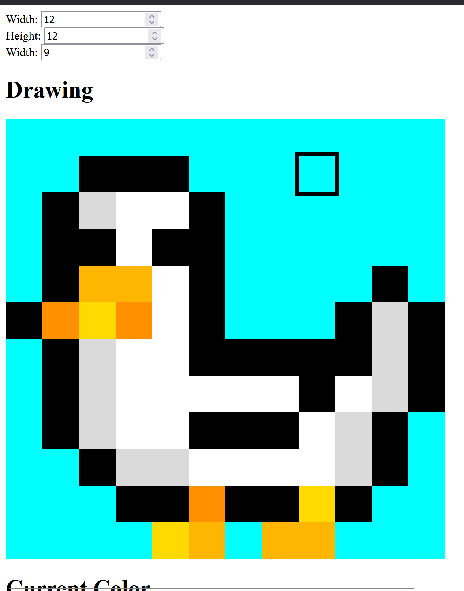
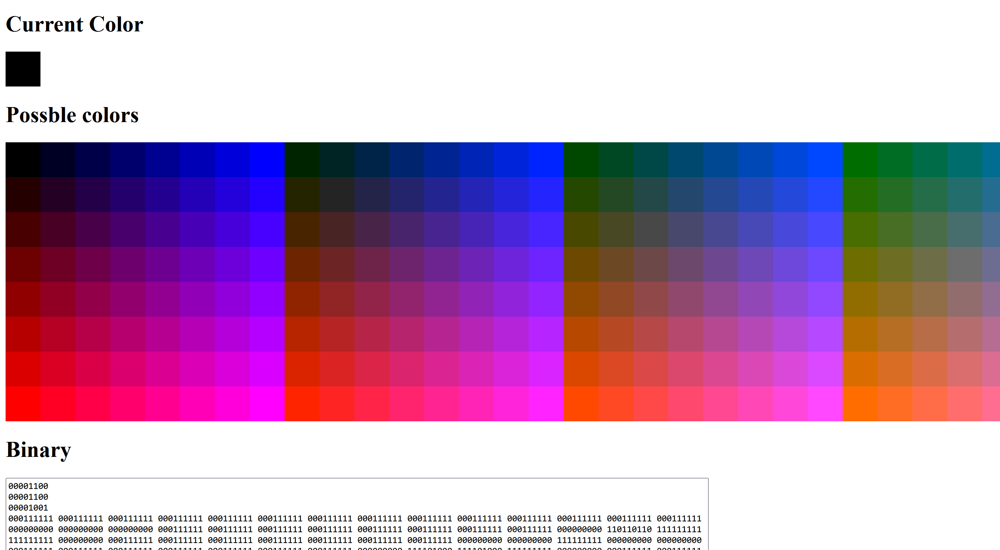
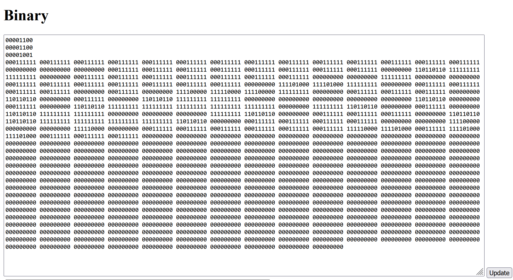

# This is a pixel editor for Code.org comp sci Leason 8 (Color images)

This uses HTML elements, the code.org editor uses a canvas which is better but its simpler if I used div elements

Open the editor [HERE](https://airplanegobrr-trash.github.io/comp-sci/Unit1/Leason8/pixelDrawer.html)

# How we get the color

1. We split the binary by whatever the bit per pixel is, EG: BPP (bits per pixel) is 9, we get 9 bits
2. We split the 9 bits into 3, for each color channel (RGB) -> 111000111 = R: 111 G: 000 B: 111
3. Using the RGB color bits we then convert them to a number, depending on how many BPP's we have it will determin the max number, EG if we have a BPP value of `9` the biggest number we will see is `7`, (111=1+2+4=7), this is known as the `maxColorValue`
4. Using the `maxColorValue` we then need to do `255 / maxColorValue` this gets us our `scaleFactor`,
   - Why do we need a `scaleFactor` or a `maxColorValue`???
    - In the world of RGB, each color channel can be a max of `255`, so `255,255,255` is white, white in binary is `111111111` (if we have a bpp value of 9 ofc)
    - Instend of making our BPP be able to show 255, (which would be 24 BPP's!) We can get colors using smaller numbers
5. Using the `maxColorValue` and `scaleFactor` we are able to determin the closest color in binary! 
 - We can do this like so: `101 = 5`, `5` is no where close to `255` so we need to **SCALE** it up! we do `5 * scaleFactor` in order to get a higher value, giving us color! `5 * 36.428 = 182.142` (we round this number making it `182`)
 - Lets say we have `101 110 011`, lets walk through what the script will do
 - 1. First we must extract the RGB bits, that being `101`, `110` and `011`
 - 2. Then we convert these to a number being, `5`, `6` and `3`
 - 3. We then must SCALE up this value using our `scaleFactor` being, `182`, `218` and `109`
 - 4. We then have an RGB value! being `rgb(182, 218, 109)`

## TLDR
We need to make the small binary number (eg `7` or `111`) be able to be within the RGB color channel range being `255`, `111=7` would be right on `255`

# How it works

1. We extract the data out of the binary using `parseBitData`, we get the width, height, maxColorValue, scaleFactor and colorBits
2. Using the `pixels` we then send it to `drawImageOnHTML` which runs a for loop, it does `width*height` for the loop, we get the index of `pixels` for the pixel, we then set the background-color to this RGB value
3. We also then run `drawColorsOnHTML` which draws out what colors we have depending on how many BPPs we have

# Final words

This was a really cool project, it opened my eyes to the world of binary and RGB